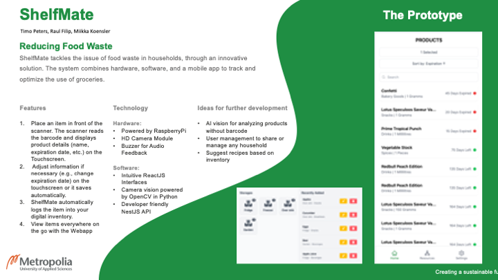

# ShelfMate Showcase

Food waste is a global issue, with private households generating over half of the wasted food. This is often caused by a lack of overview and poor planning. **ShelfMate** offers an innovative and cost-effective solution: a modular system that can be integrated into any existing storage to manage food efficiently.

The system combines a **scanner** (camera and touchscreen) with a **web application**, where all groceries are listed. By utilizing the **OpenFoodFacts API** and our own database, products are identified and stored. Users are notified before products expire, helping them to use their food more effectively.

In the future, features like **AI-based product recognition** and **household management** could be added, making the system even more adaptable and secure. ShelfMate takes an important step toward sustainable food usage.

## Poster

---

## Components

This repository consolidates all components of the **ShelfMate** project:

- **[Scan Interface](https://github.com/shelf-mate/scan-interface):** A user interface for the scanner (camera and touchscreen) to process grocery data.
- **[Backend](https://github.com/shelf-mate/backend):** Server-side logic and API for data processing and management.
- **[Scan Server](https://github.com/shelf-mate/scan-server):** Backend component responsible for handling the scanner's operations.
- **[Webapp](https://github.com/shelf-mate/webapp):** A web application where users can view and manage their groceries.
- **[API Client TS](https://github.com/shelf-mate/api-client-ts):** A TypeScript client for interacting with the ShelfMate API.

---

## Features

1. **Food Inventory Management**:
   - Keep track of all groceries in a single place.
   - Automatically update inventory via the scanner or manual entry.

2. **Expiration Notifications**:
   - Get notified before food expires to reduce waste.

3. **Seamless Integration**:
   - Designed to work with existing storage solutions.

4. **Modular Architecture**:
   - Components are designed to work independently or as part of the complete system.
